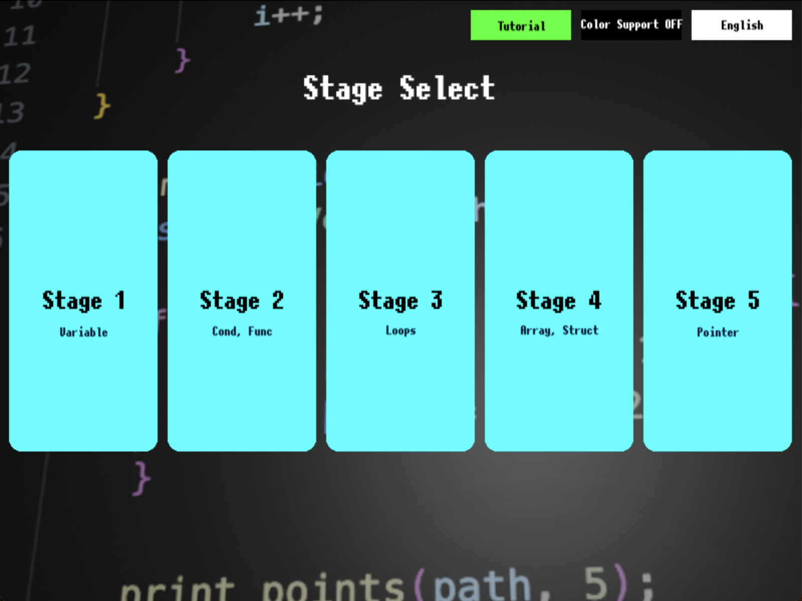
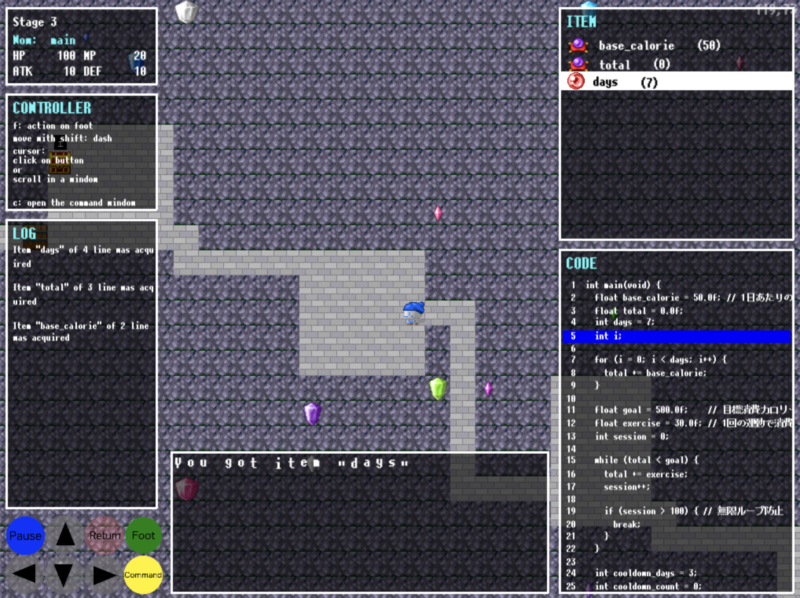

C Programming Dungeon Game

C言語プログラムダンジョン
=========================
## how to execute this system
Turn on this system after pulling the repository and changing the name of the folder "mapdata_for_distribute" to "mapdata." 

「mapdata_for_distribute」フォルダの名前を「mapdata」に変えてから本システムを起動してください. 

The "mapdata" folder contains C source codes; this system generates a map data from the source code in order to depict the dungeon map.

「mapdata」フォルダにはcソースコードが含まれており,このソースコードからマップを生成し,ダンジョンを描画します. 

It is required to install "graphviz." (it may be already solved)

graphvizをインストールする必要があります. (多分解決済みです.)

## how to play this game
Input **python simple.py** on your terminal for executing this game system.

**python simple.py** とコマンドを打つことでゲームシステムが起動します.

Click a white-blue stage button you would like to play this game.

タイトル画面のステージをクリックで選ぶと,そのステージが描画され,遊ぶことができます.

You need guide the character with a blue hat to a character with a black hat and orange skin.

青帽子のキャラクターを動かして,黒帽子のオレンジ肌のキャラクターに話しかけられたらゴールです.

**Arrow keys** are for move.

**矢印キー** で移動です.

**f key** lets you open a treasure box, or get into a well (warp zone).

**fキー** で宝箱を開ける,井戸(ワープゾーン)に入るという足元へのアクションができます.

You can talk to characters (handle return statements of functions, conditional statements, loop statements, and expressions) with **space key** or **Enter key**.

**spaceキー**, **Enterキー** で扉を開ける,キャラクター(関数のreturnや条件文の条件,計算式を司っている)に話しかけるアクションができます.

**c key** opens the command line window, and enables you input commands listed below.

**cキー** でコマンドラインを開け,以下のコマンドを入力できます.

**rollback**: you can bring back the current LLDB step executions to a point (line) where you chose.

**rollback**: 特定の行番まで今までの処理を巻き戻すことが可能です.

**stdin s++**: Stdin (e.x. input "stdin 3 4" for scanf(%d, %d))

**stdin s+**: 標準入力 (scanf(%d, %d)の場合、stdin 3 4のように入力)

**up**, **down**, **right**, **left**: move in the direction

**up**, **down**, **right**, **left**: 指定の方向へ動けるならば１マス動く.

## current game image

a game screen as of **12/26/2025**

**12/26/2025**地点でのゲーム画面です.

enabled the system to draw both of the mini-map window and the code window at the same time

ミニマップとコードウィンドウを同時に表示できるようにしました.

added the windows for how-to-play and action log.

操作説明用のウィンドウ,今までのアクションをログで表示するためのウィンドウを追加しました.

enabled opening the command window and searching on foot not only by keys but also by UI buttons at left bottom of the screen.

コマンドウィンドウを開く,足元を調べるアクションを,キーではなくボタンを押すことでも可能にしました.

a game screen as of **1/29/2026**

**1/29/2026**地点でのゲーム画面です.

for clearer understanding about roles of each windows on a screen, 
set letters of the roles on left top of the windows. 

各ウィンドウの役割が分かるように,ウィンドウの左上に役割名を表示できるようにしました.

enabled scrolling contents in every screen

操作説明ウィンドウ,ログウィンドウも他のウィンドウと同様にスクロールできるようにしました.

as of **2/8/2026**, you can play in the English mode.

**2/8/2026**現在,英語訳モードの切り替えも可能になりました.

## tips for developing this system
You can generate gigantic askey arts in files of this project with **VScode Banner Comment Generator** extension.
Don't forget to install **figlet** after adding the extension.

コード内の巨大アスキーアートは **VScode Banner Comment Generator** 拡張機能で生成できます.
拡張機能を追加した後,**figlet**を忘れずにインストールしてください.

sockets by **sender module** make TCP connection between the game system and LLDB.

**sender モジュール** でソケットによって, ゲーム側とLLDB側のTCP通信を管理しています.

## Acknowledgment
We use map tile images which we downloaded on **pipoya.net**

マップチップ素材は**ぴぽ屋さん(pipoya.net)**のものを利用しています.

# SE 効果音
otosozai.com　https://otosozai.com/ 
(for commercial use, contact the web site 商用でのご利用の際は, メールフォームより連絡すること。).

OtoLogic
