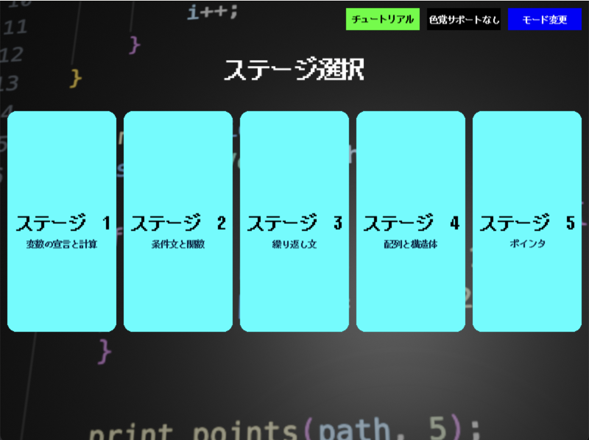
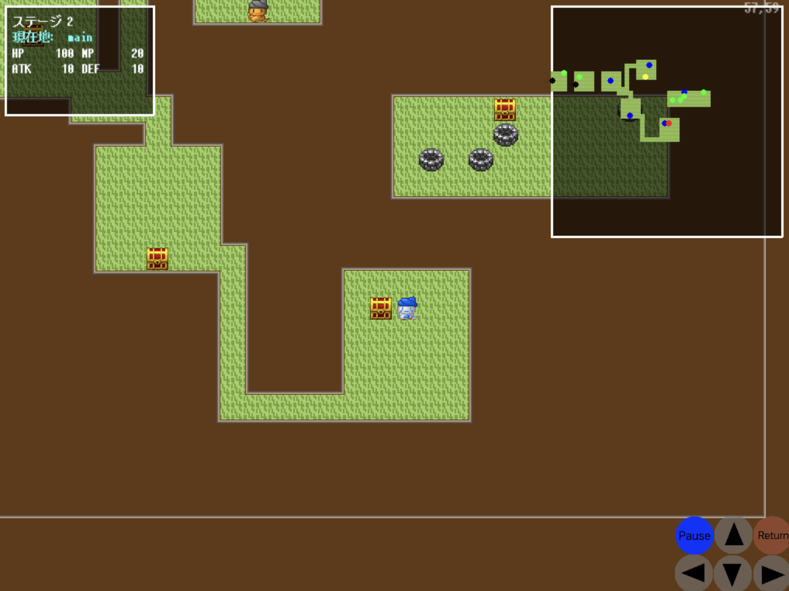
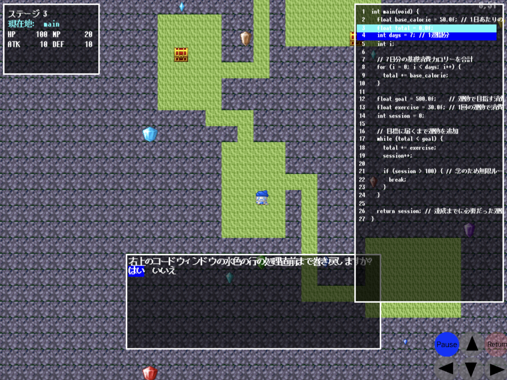
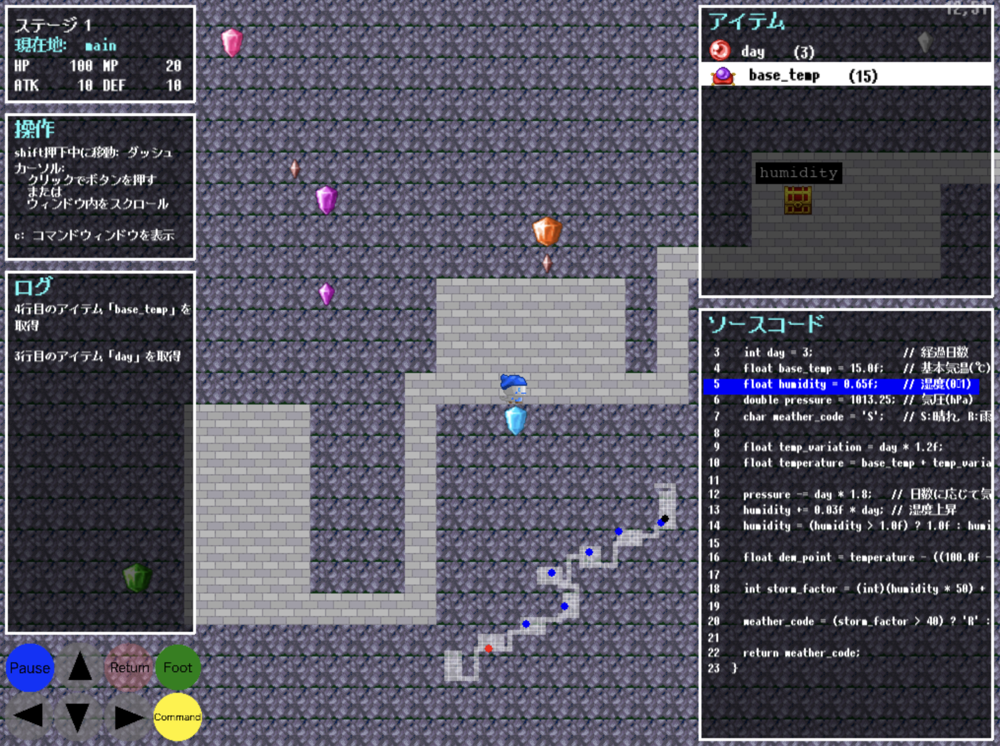
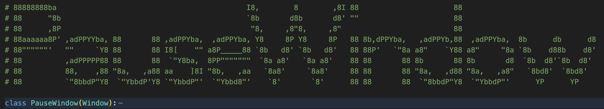

C言語プログラムダンジョン
=========================
## how to execute this system
「mapdata_for_distribute」フォルダの名前を「mapdata」に変えてから本システムを起動してください. 

「mapdata」フォルダにはcソースコードが含まれており、このソースコードからマップを生成し、ダンジョンを描画します. 

graphvizをインストールする必要があります. (多分解決済みです.)

## how to play this game
「python simple.py」とコマンドを打つことでゲームシステムが起動します.

タイトル画面のステージをクリックで選ぶと、そのステージが描画され、遊ぶことができます.

青帽子のキャラクターを動かして、黒帽子のオレンジ肌のキャラクターに話しかけられたらゴールです.

「矢印キー」で移動です.

「fキー」で宝箱を開ける、井戸(ワープゾーン)に入るというアクションができます.

「spaceキー」、「エンターキー」で扉を開ける、キャラクター(関数のreturnや条件文の条件、計算式を司っている)に話しかけるアクションができます.

「mキー」でミニマップウィンドウの表示非表示を切り替えられます.

「cキー」でコマンドラインを開け、以下のコマンドを入力できます.

rollback: 特定の行番まで今までの処理を巻き戻すことが可能です.

stdin s+: 標準入力 (stdin 3 4のように入力).

up, down, right, left   : 指定の方向へ動けるならば１マス動く.

## current game image

12/26/2025地点でのゲーム画像です.

ミニマップとコードウィンドウを同時に表示できるようにしました.

操作説明用のウィンドウ、今までのアクションをログで表示するためのウィンドウを追加しました.

コマンドウィンドウを開く、足元を調べるアクションを、キーではなくボタンを押すことでも可能にしました.

1/29/2026地点でのゲーム画像です.
各ウィンドウの役割が分かるように、ウィンドウの左上に役割名を表示できるようにしました.
操作説明ウィンドウ、ログウィンドウも他のウィンドウと同様にスクロールできるようにしました.

## tips for developing this system
コード内の巨大アスキーアートは「VScode Banner Comment Generator」拡張機能で生成できます.

拡張機能を追加した後、figletを忘れずにインストールしてください.

senderクラスでソケットによるTCP通信を管理しています.

## Acknowledgment
マップチップ素材はぴぽ屋さん(pipoya.net)のものを利用しています.

# 効果音
otosozai.com　https://otosozai.com/ (商用でのご利用の際は、メールフォームより連絡すること。).

OtoLogic
